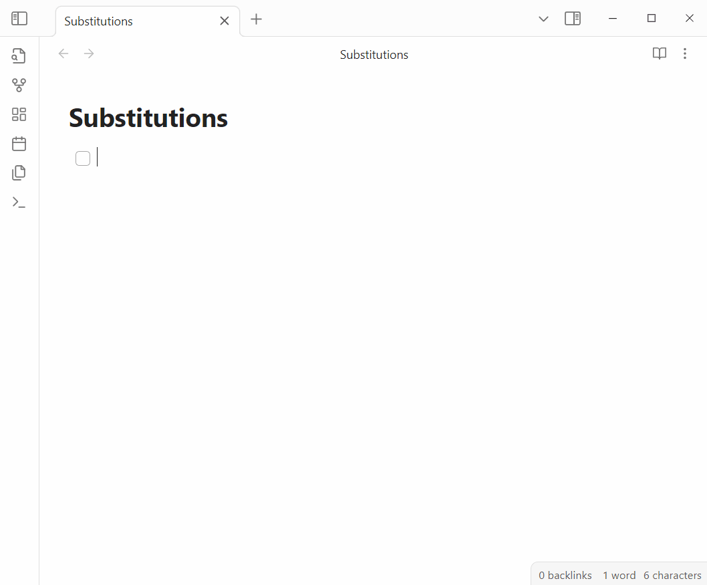

# Obsidian Substitutions

Automatically substitute text fragments with symbols or different text.

> *This is a plugin for [Obsidian: substitutions](https://obsidian.md/plugins?id=substitutions)*.

## Usage

You can configure your substitutions via the settings pane.
Enable/disable them or remove them completely!
Add new substitutions while editing without going to settings via a command and use them immediately!

As you type, text fragments are automatically replaced with your configured substitutions. For example, typing `->` can be automatically transformed into `→`.

Use special characters in your substitutions:
- `\n` for newline
- `\t` for tab
- `\b` for backspace
- `\\` for backslash
