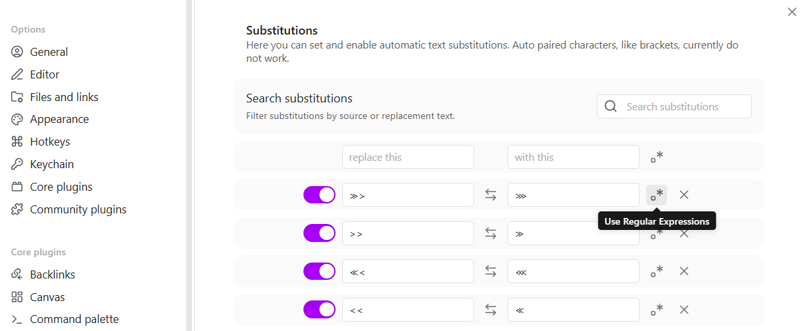
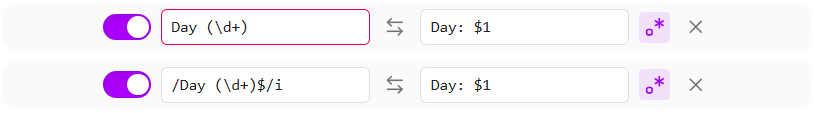

# Obsidian Substitutions

Automatically substitute text fragments with symbols or different text.

> *This is a plugin for [Obsidian: substitutions](https://obsidian.md/plugins?id=substitutions)*.

Requires Obsidian 1.5.12 or newer and works on desktop and mobile.

## Usage

The plugin replaces text while you type in the editor.
It checks the end of the text you have typed so far and replaces it when it matches a rule.
Substitutions are triggered by direct typing, so the plugin does not retroactively rewrite existing note content.
Because the input handler only handles single-character direct input, multi-character insertions such as pasted text may not trigger substitutions.

The plugin does not start empty.
It includes built-in defaults such as `-->` -> `→`, `<--` -> `←`, `!=` -> `≠`, and `1/2` -> `½`.
You can edit, disable, or remove those defaults just like your own rules.

To manage rules, open `Settings -> Substitutions`.
There you can enable or disable rules, add rules, remove rules, and search or filter by source or replacement text.
Each rule row also includes icon-only actions with tooltips: `Swap from and to` swaps the source and replacement values, and `Use Regular Expressions` toggles regex mode.

If you want to add a rule while editing, run the `Add Substitution` command.
If text is selected, that selection is prefilled as the source for the new rule.

### Settings

Use `Settings -> Substitutions` to review and manage your rules.
You can edit built-in defaults and your own rules in the same list and use the search field to quickly find rules by source or replacement text.

### Regex substitutions

When regex mode is enabled for a rule, the source must use `/pattern$/flags` syntax.
The trailing `$` is required because matches must end at the current cursor position.
Flags `g` and `y` are not supported, but other standard JavaScript flags such as `i` are supported.
In the replacement text, regex rules support normal JavaScript `String.replace` capture placeholders such as `$1` and `$2`.

Invalid regex rules are ignored until fixed and are visibly marked invalid in settings.
If any enabled invalid regex rules exist, the plugin shows a notice on load saying they will be ignored and can be fixed in settings.

### Add Substitution

Run `Add Substitution` from the Command Palette while editing to create a new rule without leaving the note.
If text is selected, that selection is prefilled as the source.

### Replacement field escapes

These escapes are supported only in the replacement field: `\n`, `\t`, `\b`, and `\\`.
They are not special syntax inside regex patterns.

### Undo the last replacement

Press *Backspace* once immediately after a substitution, before you move the caret elsewhere, to restore the text you had typed before that replacement.
